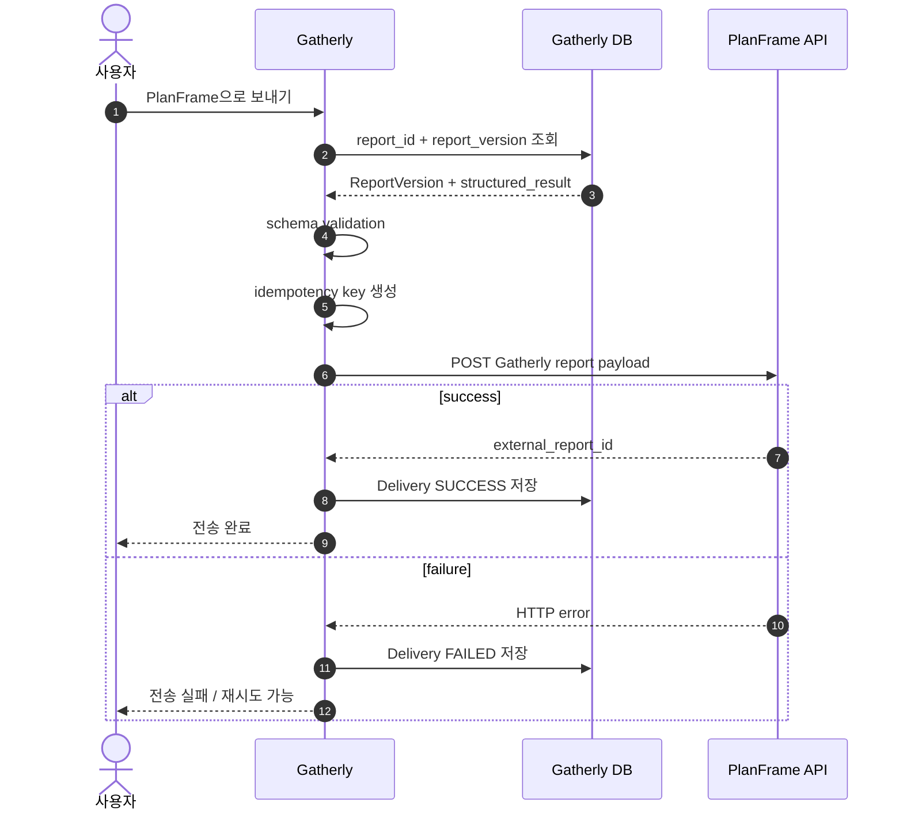

# Gatherly AI Reports Software Requirements Specification

## 1. 문서 개요

- 문서명: Gatherly AI Reports Software Requirements Specification
- 문서 버전: 1.1
- 기준일: 2026-09-12
- 대상 모듈: Gatherly Reports / AI Report Generator / External Integration
- 상위 문서: `SRS.md`, `PRD.md`
- 핵심 연동 대상: PlanFrame

본 문서는 Gatherly의 현장조사 보고서 생성, 버전관리, 구조화 결과 저장 및 외부 시스템 전송 요구사항을 정의한다. Gatherly 보고서는 사람이 읽는 PDF/Google Docs뿐 아니라 PlanFrame과 같은 후속 분석 시스템이 API로 재사용할 수 있는 구조화된 리서치 결과물이어야 한다.

---

## 2. 핵심 설계 원칙

### 2.1 Analysis Direction First

보고서 생성은 사용자의 분석 방향 입력으로 시작한다. 동일한 현장 자료라도 시장성, 마케팅 전략, 경쟁사 분석, 소비자 트렌드 등 분석 목적에 따라 서로 다른 결과가 생성되어야 한다.

### 2.2 Evidence-based Report

보고서는 다음 세 근거를 구분한다.

- `FIELD`: Gatherly에서 직접 수집한 사진, 영상, 음성, 텍스트 메모
- `EXTERNAL`: 공식 통계, 공공기관, 기업 공식자료, 전문 리서치, 신뢰도 높은 외부 조사
- `INFERENCE`: FIELD와 EXTERNAL을 바탕으로 AI가 도출한 분석과 제언

### 2.3 Versioned Structured Report

보고서 데이터는 문서 HTML/Markdown만 저장해서는 안 된다. 모든 보고서 버전은 최소 다음 세 식별·교환 요소를 가져야 한다.

- `report_id`: 보고서 전체 생명주기 동안 변하지 않는 영구 식별자
- `report_version`: 동일 `report_id` 안에서 증가하는 불변 버전 번호
- `structured_result`: 후속 시스템이 직접 소비할 수 있는 구조화 결과 JSON

PDF와 Google Docs는 출력 포맷이며 시스템 간 연동의 기준 데이터는 `structured_result`이다.

---

## 3. 전체 보고서 흐름

```text
FieldDay / Materials
        ↓
사용자 분석 방향 입력
        ↓
AI 분석 계획
        ↓
사용자 계획 검토·승인
        ↓
Evidence Extraction
        ↓
External Research
        ↓
Insight Synthesis
        ↓
Draft Report
        ↓
structured_result 생성
        ↓
Report Version 저장
        ↓
사용자 AI 수정 / 직접 수정
        ↓
새 Report Version 생성
        ↓
Final QA
        ↓
PDF / Google Docs
        ↓
PlanFrame API Export
```

---

## 4. 식별자 및 버전 요구사항

### FR-ID-001 `report_id`

- 각 보고서는 생성 시 유일한 `report_id`를 부여받아야 한다.
- `report_id`는 보고서 제목 변경, AI 재작성, 사용자 직접 수정, PDF 재출력과 관계없이 변경되지 않아야 한다.
- PlanFrame을 포함한 외부 시스템은 `report_id`를 Gatherly 보고서의 canonical identifier로 사용해야 한다.

### FR-ID-002 `report_version`

- 첫 저장 버전은 `1`부터 시작한다.
- AI 수정 적용, 사용자 명시적 버전 저장, 이전 버전 복원, Final 확정 등 의미 있는 보고서 변경 시 증가해야 한다.
- 기존 버전은 수정하지 않는 immutable snapshot으로 유지해야 한다.
- `(report_id, report_version)` 조합은 유일해야 한다.

### FR-ID-003 버전 복원

과거 버전을 복원할 때 과거 레코드를 덮어쓰지 않고 해당 snapshot을 기반으로 새로운 `report_version`을 생성해야 한다.

---

## 5. `structured_result` 요구사항

### FR-STR-001 기본 정의

`structured_result`는 JSON object로 직렬화하여 저장하며 최소 다음 구조를 지원해야 한다.

```json
{
  "schema_version": "gatherly.report.v1",
  "report_type": "MARKET_FEASIBILITY",
  "analysis_direction": "사용자가 입력한 분석 방향",
  "executive_summary": {
    "summary": "",
    "key_findings": [],
    "key_risks": [],
    "key_opportunities": []
  },
  "findings": [],
  "insights": [],
  "recommendations": [],
  "metrics": [],
  "evidence_refs": [],
  "external_sources": [],
  "selected_images": [],
  "tags": []
}
```

### FR-STR-002 스키마 버전

- `structured_result`에는 반드시 `schema_version`을 포함한다.
- 최초 버전은 `gatherly.report.v1`로 정의한다.
- 필드 의미가 호환되지 않게 변경될 경우 새로운 schema version을 사용한다.
- PlanFrame은 `schema_version`을 기준으로 payload parser를 선택할 수 있어야 한다.

### FR-STR-003 Findings

각 finding은 최소 다음 구조를 지원한다.

```json
{
  "finding_id": "F-001",
  "title": "",
  "summary": "",
  "importance": "HIGH",
  "evidence_ids": ["EV-001"],
  "source_types": ["FIELD"]
}
```

### FR-STR-004 Insights

```json
{
  "insight_id": "I-001",
  "title": "",
  "analysis": "",
  "confidence": "HIGH",
  "evidence_ids": ["EV-001", "EV-009"],
  "source_ids": ["SRC-002"]
}
```

### FR-STR-005 Recommendations

```json
{
  "recommendation_id": "R-001",
  "title": "",
  "action": "",
  "priority": "HIGH",
  "rationale": "",
  "related_insight_ids": ["I-001"]
}
```

### FR-STR-006 Metrics

PlanFrame이 정량 정보를 재사용할 수 있도록 주요 시장규모, 성장률, 가격, 점수 등은 본문 문장에만 넣지 않고 별도 `metrics` 배열에도 저장해야 한다.

```json
{
  "metric_id": "M-001",
  "name": "시장 성장률",
  "value": 8.4,
  "unit": "%",
  "period": "2025-2030 CAGR",
  "source_id": "SRC-004"
}
```

### FR-STR-007 Evidence Reference

`structured_result`는 원본 파일 전체를 복제하지 않고 Gatherly 내부 Evidence ID와 Material ID를 참조해야 한다.

```json
{
  "evidence_id": "EV-001",
  "material_id": "...",
  "evidence_type": "FIELD",
  "summary": "",
  "captured_at": "2026-09-12T10:00:00+09:00"
}
```

### FR-STR-008 External Sources

외부 조사 출처에는 최소 다음을 포함한다.

- `source_id`
- `title`
- `publisher`
- `url`
- `published_at`
- `accessed_at`
- `source_tier`

---

## 6. 보고서 버전 데이터 모델

### 6.1 Report

Report는 보고서의 영구 identity와 현재 상태를 관리한다.

필수 개념 필드:

```text
report_id
field_day_id
title
status
current_report_version
created_at
updated_at
deleted_at
```

### 6.2 ReportVersion

실제 보고서 결과는 버전별 snapshot으로 저장한다.

```text
id
report_id
report_version
version_type
content
structured_result
structured_schema_version
created_by
created_at
```

제약조건:

```text
UNIQUE(report_id, report_version)
```

### 6.3 Source of Truth

- 보고서 identity의 Source of Truth: `Report`
- 특정 시점의 결과물 Source of Truth: `ReportVersion`
- 외부 API 교환 Source of Truth: `ReportVersion.structured_result`
- PDF/Google Docs: 해당 ReportVersion에서 생성된 파생 출력물

---

## 7. AI 수정 및 사용자 편집

### FR-REV-001 AI 수정

사용자는 초안 생성 후 자연어로 수정 요청을 할 수 있어야 한다.

지원 범위:

- 선택 텍스트
- Block
- Section
- 복수 Section
- 전체 보고서

### FR-REV-002 수정 Preview

AI 수정 결과는 기존 버전을 즉시 덮어쓰지 않고 Preview 상태로 표시해야 한다.

사용자가 `적용`한 경우에만 새로운 `report_version`을 생성한다.

### FR-REV-003 추가 조사

수정 요청이 최신 시장자료 또는 새로운 외부 근거를 요구하면 추가 Research를 수행하고 `structured_result.external_sources`, 관련 findings/insights를 함께 갱신해야 한다.

### FR-REV-004 직접 편집

사용자는 Gatherly UI에서 본문, 제목, 표, 캡션, Recommendation을 직접 수정할 수 있어야 한다.

직접 편집한 내용이 버전으로 저장될 때 해당 버전의 `structured_result`도 재정규화해야 한다.

---

## 8. Google Docs / PDF

### FR-EXP-001 PDF

- A4 Landscape 297 × 210mm
- 주요 현장 이미지는 기본 148.5 × 148.5mm 정사각형 영역
- Reference 포함

### FR-EXP-002 Google Docs

현재 ReportVersion을 편집 가능한 Google Docs로 출력할 수 있어야 한다.

MVP에서는 Gatherly → Google Docs 단방향 Export를 사용한다.

Google Docs 수정 내용은 자동으로 Gatherly의 `structured_result`를 변경하지 않는다.

---

# 9. PlanFrame Integration

## 9.1 목적

Gatherly에서 완성된 현장조사 보고서를 PlanFrame의 사업전략 분석 입력자료로 직접 전달할 수 있어야 한다.

PlanFrame은 Gatherly의 PDF를 다시 OCR하거나 자유 텍스트 전체를 재해석하는 방식이 아니라 `structured_result`를 우선 사용해야 한다.

이를 통해 다음을 재사용할 수 있다.

- 시장 Findings
- 소비자 Insight
- 경쟁사 정보
- 시장 지표
- Opportunity / Risk
- Recommendation
- Evidence / Source link

---

## 9.2 Gatherly Export API

### FR-PF-001 사용자 실행

보고서 상세화면에 다음 액션을 제공할 수 있어야 한다.

```text
PlanFrame으로 보내기
```

기본 전송 대상은 현재 Final 또는 사용자가 명시적으로 선택한 ReportVersion이다.

### FR-PF-002 Gatherly 내부 Endpoint

권장 Gatherly endpoint:

```http
POST /api/reports/{report_id}/export/planframe
```

Request 예:

```json
{
  "report_version": 3
}
```

### FR-PF-003 PlanFrame 수신 Endpoint

PlanFrame 측 권장 계약:

```http
POST /api/integrations/gatherly/reports
```

실제 URL은 환경설정으로 주입하며 코드에 고정하지 않는다.

---

## 9.3 PlanFrame Payload Contract

Gatherly가 PlanFrame으로 전송하는 payload의 top-level 필드는 다음을 기본으로 한다.

```json
{
  "source_system": "gatherly",
  "schema_version": "gatherly.report.v1",
  "report_id": "cuid-or-uuid",
  "report_version": 3,
  "report_version_id": "version-record-id",
  "title": "2026 푸드위크 시장성 분석",
  "report_type": "MARKET_FEASIBILITY",
  "status": "FINAL",
  "generated_at": "2026-09-12T23:30:00+09:00",
  "analysis_direction": "...",
  "structured_result": {},
  "source_summary": {
    "field_material_count": 42,
    "external_source_count": 11
  },
  "links": {
    "gatherly_report_url": null,
    "pdf_url": null
  }
}
```

### 필수 필드

PlanFrame 전송 시 다음은 null일 수 없다.

- `source_system`
- `schema_version`
- `report_id`
- `report_version`
- `report_version_id`
- `title`
- `status`
- `structured_result`

---

## 9.4 멱등성 및 중복 방지

### FR-PF-010 Idempotency Key

전송 멱등키는 다음 규칙으로 생성한다.

```text
gatherly:{report_id}:{report_version}
```

HTTP Header 권장:

```http
Idempotency-Key: gatherly:{report_id}:{report_version}
```

### FR-PF-011 동일 버전 재전송

동일한 `report_id + report_version`을 다시 전송해도 PlanFrame에 중복 보고서가 생성되어서는 안 된다.

### FR-PF-012 새 버전 전송

동일 `report_id`의 높은 `report_version`이 전송되면 PlanFrame은 기존 문서를 조용히 덮어쓰지 않고 동일 원본 보고서의 새 revision으로 취급할 수 있어야 한다.

---

## 9.5 전송 상태 저장

Gatherly는 PlanFrame 전송 이력을 별도 레코드로 저장해야 한다.

`ReportIntegrationDelivery` 개념 필드:

```text
id
report_id
report_version_id
destination
idempotency_key
status
attempt
payload_hash
http_status
external_report_id
sent_at
error_code
error_message
created_at
updated_at
```

상태:

```text
QUEUED
SENDING
SUCCESS
FAILED
```

---

## 9.6 재시도 정책

### FR-PF-020

네트워크 오류, timeout, HTTP 5xx는 재시도 가능한 오류로 분류한다.

### FR-PF-021

HTTP 4xx 계약 오류는 자동 무한 재시도하지 않는다.

### FR-PF-022

재시도 시 반드시 동일한 idempotency key를 사용한다.

### FR-PF-023

실패한 전송 때문에 Gatherly 원본 ReportVersion이 변경되거나 삭제되어서는 안 된다.

---

## 9.7 PlanFrame 전송 전 Validation

다음 검증을 통과해야 한다.

- ReportVersion 존재
- `report_id` 존재
- `report_version >= 1`
- `structured_result` JSON parse 성공
- `schema_version` 지원값
- 핵심 findings/insights/recommendations 구조 유효
- 필수 외부 숫자에 source reference 존재

Final 보고서 전송을 기본으로 하되, 개발/테스트 환경에서는 명시적으로 Draft 전송을 허용할 수 있다.

---

## 9.8 보안

### NFR-PF-001

PlanFrame API credential은 `.env` 등 서버 비밀영역에 저장하며 클라이언트 브라우저로 노출하지 않는다.

### NFR-PF-002

API 전송은 HTTPS를 사용한다.

### NFR-PF-003

Gatherly 내부 절대 파일경로, Codex 인증정보, ChatGPT 세션정보, Google token을 payload에 포함해서는 안 된다.

### NFR-PF-004

외부 전송은 명시적으로 설정된 PlanFrame base URL만 허용한다.

---

## 9.9 이미지 및 Asset 정책

`structured_result.selected_images`에는 원본 바이너리가 아니라 다음 메타데이터를 저장한다.

```json
{
  "material_id": "...",
  "caption": "...",
  "role": "EVIDENCE",
  "mime_type": "image/jpeg"
}
```

Mac mini 로컬 절대경로를 PlanFrame payload에 넣지 않는다.

이미지 원본 전송이 필요해질 경우 별도의 Asset Upload API 또는 임시 signed URL 방식을 후속 버전으로 구현한다.

---

## 10. PlanFrame 연동 데이터 흐름



---

## 11. API 응답 예

Gatherly 내부 ReportVersion 조회 API는 외부 연동이 가능하도록 다음 표준 shape를 제공할 수 있어야 한다.

```json
{
  "report_id": "...",
  "report_version": 3,
  "report_version_id": "...",
  "schema_version": "gatherly.report.v1",
  "status": "FINAL",
  "structured_result": {},
  "created_at": "2026-09-12T23:30:00+09:00"
}
```

내부 UI용 추가 정보는 별도 필드로 확장할 수 있으나 위 필드의 의미를 변경해서는 안 된다.

---

## 12. 수용 기준

### AC-PF-001

Given Gatherly 보고서가 존재하고
And 버전 3이 Final이며
When 사용자가 PlanFrame 전송을 실행하면
Then payload에는 동일한 `report_id`, `report_version=3`, 해당 버전의 `structured_result`가 포함되어야 한다.

### AC-PF-002

동일 버전 전송을 두 번 실행해도 PlanFrame에서 서로 다른 원본 보고서 두 개로 생성되어서는 안 된다.

### AC-PF-003

버전 3 전송 후 버전 4를 전송하면 PlanFrame이 같은 `report_id`를 가진 별도 revision으로 구분할 수 있어야 한다.

### AC-PF-004

PlanFrame 전송 실패 시 Gatherly의 ReportVersion과 `structured_result`가 변경되어서는 안 된다.

### AC-PF-005

사용자 보고서 본문을 수정해 새로운 버전을 저장하면 새 버전에 대응하는 `structured_result`가 생성되어야 한다.

### AC-PF-006

API payload에 Mac mini 절대 파일 경로나 인증정보가 포함되어서는 안 된다.

---

## 13. 구현 우선순위

### Phase A — 지금 반영

- `report_id` canonical identifier
- `report_version` immutable version
- `structured_result` 저장
- `schema_version` 저장
- ReportVersion 모델
- PlanFrame delivery 모델

### Phase B — 보고서 생성 엔진 구현 시

- Draft 생성과 동시에 structured result 생성
- 사용자 수정 후 structured result 재정규화
- Final QA

### Phase C — PlanFrame 연동 시

- Gatherly PlanFrame Export API
- PlanFrame receiver API
- token 인증
- idempotency
- retry / delivery status UI

---

## 14. 최종 데이터 계약 원칙

Gatherly 보고서 연동의 최소 안정 계약은 다음 네 값이다.

```text
report_id
report_version
schema_version
structured_result
```

이 네 필드는 PDF, Google Docs, Gatherly UI 레이아웃과 독립적으로 유지해야 한다.

따라서 향후 PlanFrame뿐 아니라 Contentory, 데이터 분석 도구, 전략기획 도구 등 다른 서비스가 Gatherly 결과를 받아 사용할 때도 동일한 계약을 재사용할 수 있어야 한다.
