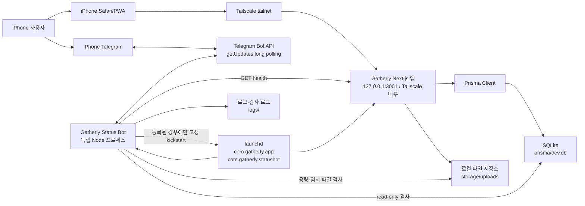
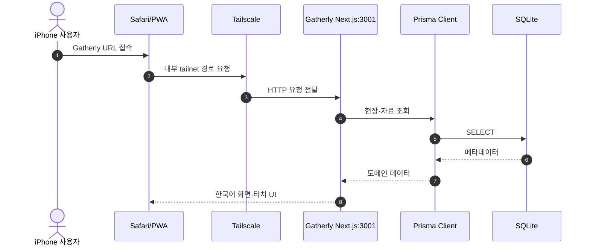
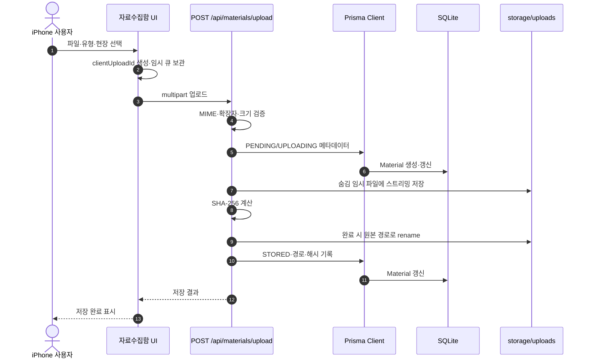
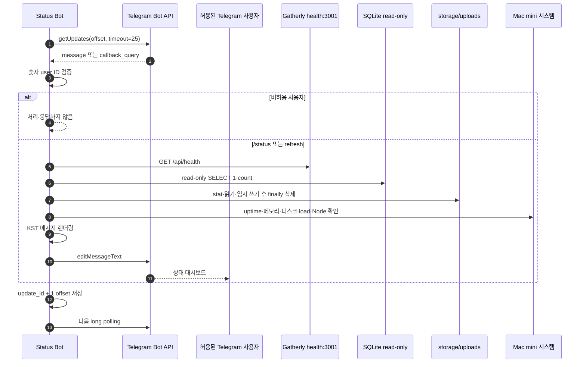
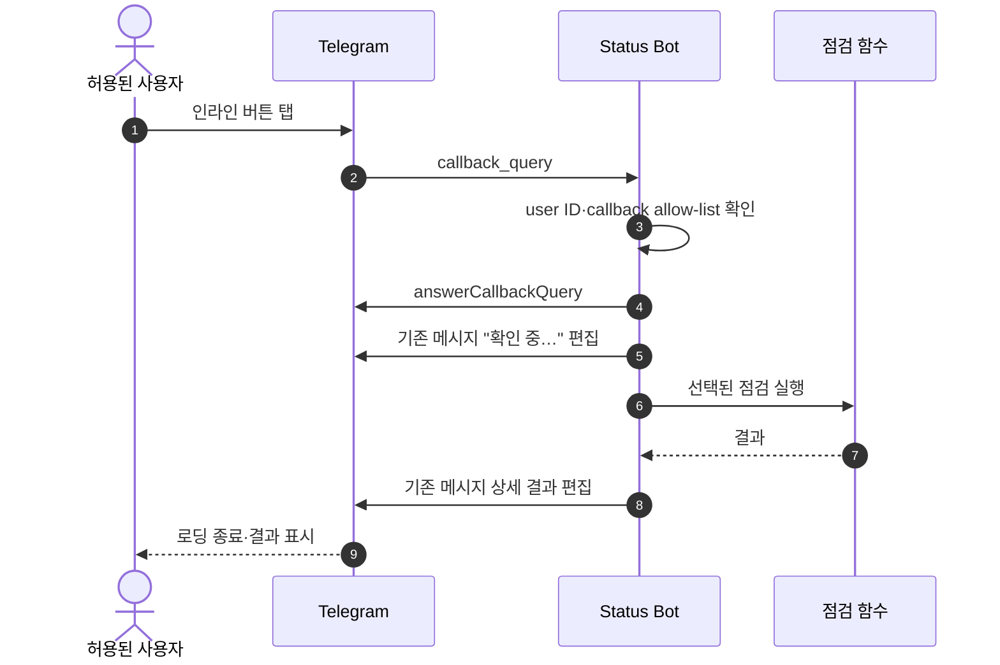
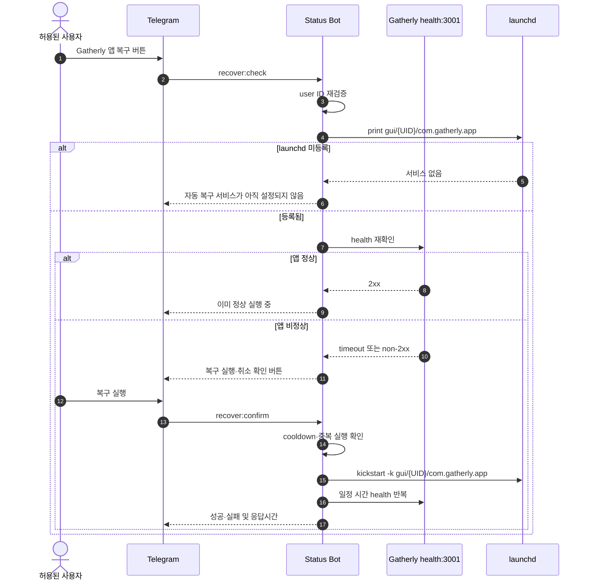
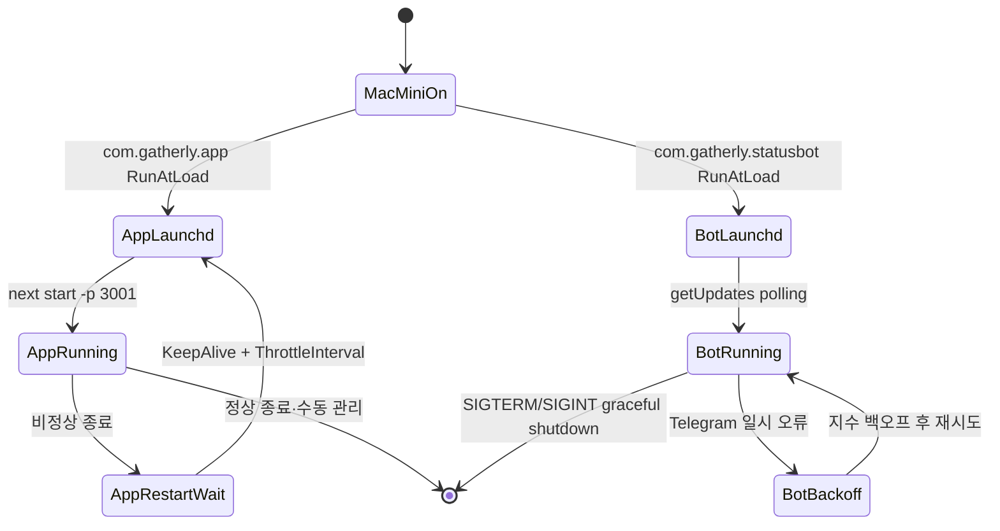
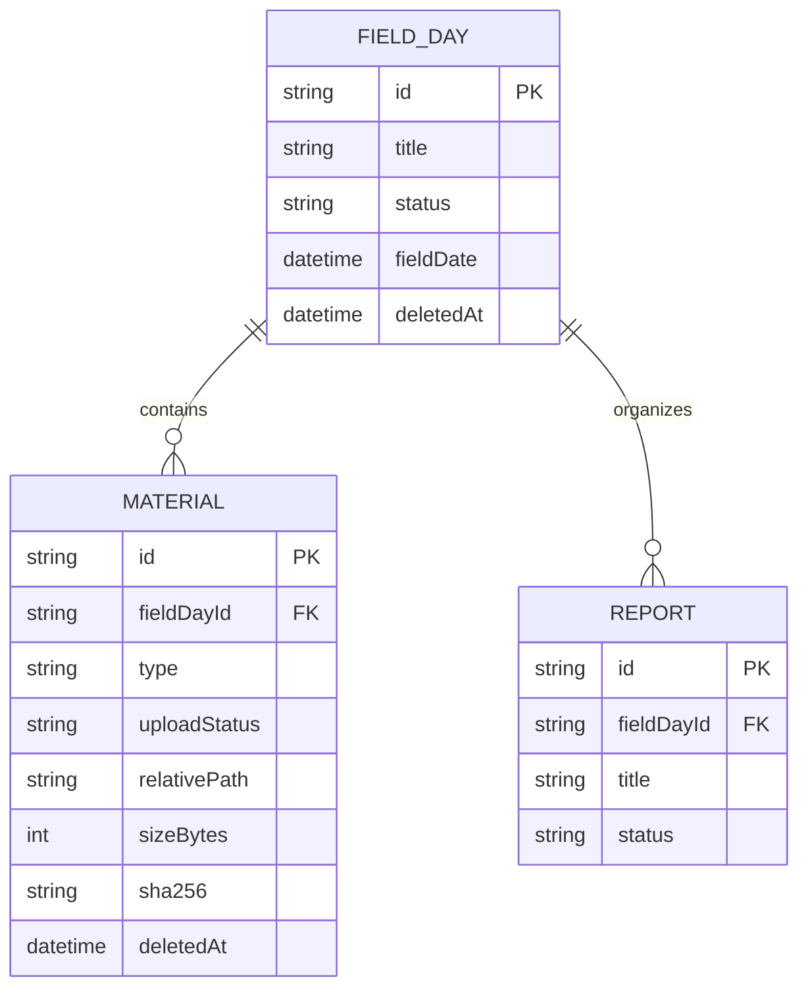

# Gatherly Software Requirements Specification

## 1. 문서 개요

- 문서명: Gatherly Software Requirements Specification
- 문서 버전: 1.0
- 기준일: 2026-09-09
- 적용 단계: 1차 개발 완료 기준
- 대상 시스템: Gatherly 웹 앱, Mac mini 로컬 서버, Telegram 상태 봇, Tailscale 내부 접근
- 관련 문서: [PRD.md](./PRD.md), [macmini/status-bot-setup.md](./macmini/status-bot-setup.md)

이 문서는 Gatherly를 구성하는 각 실행 주체의 책임과 데이터 흐름을 구현·운영 관점에서 정의한다. 외부 공개 배포와 launchd 실제 등록은 현재 범위에 포함하지 않으며, 템플릿과 수동 절차만 제공한다.

## 2. 시스템 범위

Gatherly는 현장 조사 자료를 Mac mini의 로컬 SQLite와 파일 저장소에 보관하는 Next.js 애플리케이션이다. iPhone 사용자는 Tailscale 내부 네트워크에서 웹 앱을 사용하거나 Telegram으로 상태 봇에 메시지를 보내 서버 상태를 확인한다.

범위에 포함되는 기능:

- 현장 생성·조회·상태 관리
- 사진·영상·음성·텍스트 자료 수집
- SQLite 메타데이터 저장
- `storage/uploads` 파일 저장
- 앱 health endpoint
- Telegram long polling 상태 대시보드
- 고정된 launchd 앱 복구 흐름
- Mac mini 수동·launchd 운영 템플릿

범위에 포함되지 않는 기능:

- Telegram webhook
- 외부 SaaS 데이터베이스
- 공개 인터넷 관리자 페이지
- Mac mini 재부팅·종료·잠자기
- 임의 shell 명령 실행
- Telegram을 통한 파일 삭제·수정
- 실제 launchd 자동 등록

## 3. 용어 및 식별자

| 용어 | 정의 |
|---|---|
| 현장(FieldDay) | 자료가 수집되는 조사 단위 |
| 자료(Material) | 이미지·영상·음성·텍스트로 저장되는 조사 자료 |
| 앱 | `next start`로 실행되는 Gatherly Next.js 서버 |
| 상태 봇 | 앱과 독립적으로 실행되는 `scripts/gatherly-status-bot` 프로세스 |
| 운영자 | 허용된 숫자 Telegram user ID를 가진 단일 사용자 |
| 저장소 | 기본 `storage/uploads` 아래의 사용자 업로드 파일 영역 |
| health | `GET /api/health`가 반환하는 최소 운영 상태 |
| launchd 앱 서비스 | 고정 label `com.gatherly.app` |
| launchd 상태 봇 서비스 | 고정 label `com.gatherly.statusbot` |

## 4. 시스템 주체

### 4.1 주체별 책임 요약

| 주체 | 실행 위치 | 주요 책임 | 절대 하지 않는 일 |
|---|---|---|---|
| iPhone Safari/PWA | iPhone | Tailscale 내부에서 Gatherly 웹 UI 사용, 자료 선택·업로드 | DB 직접 접근, 서버 명령 실행 |
| iPhone Telegram | iPhone | `/start`, `/status`, `/help`, 인라인 버튼 입력 | 비허용 사용자 인증 우회 |
| Tailscale | Mac mini와 iPhone 사이 | 사설 tailnet 경로 제공 | 애플리케이션 권한·Telegram 인증 대체 |
| Telegram Bot API | Telegram 인프라 | 상태 봇 update 전달, 메시지 edit/send, callback 응답 | Mac mini 프로세스 직접 제어 |
| 상태 봇 | Mac mini 독립 Node 프로세스 | update polling, user ID 검증, 상태 점검, 메시지 렌더링, 제한된 복구 요청 | 앱 데이터 쓰기, OS 재부팅, 임의 명령 실행 |
| launchd | Mac mini 사용자 세션 | 앱·봇 RunAtLoad/KeepAlive 관리, 고정 앱 서비스 kickstart | 미등록 서비스 자동 생성 |
| Next.js 앱 | Mac mini `:3001` | 웹 UI·API·health 제공, 요청 검증, 도메인 로직 호출 | Telegram polling, OS 명령 실행 |
| Prisma Client | Next.js 프로세스 | SQLite 연결·쿼리 추상화, 도메인 모델 접근 | 외부 DB 연결 |
| SQLite | Mac mini `prisma/dev.db` | FieldDay·Material·Report 메타데이터 저장 | 파일 바이너리 저장 |
| 로컬 파일 저장소 | Mac mini `storage/uploads` | 업로드 원본 파일 저장 | Telegram 전송, 임의 경로 저장 |
| 로그 파일 | Mac mini `logs` 및 설정된 앱 로그 | 상태 봇·앱·복구 감사 기록 | 토큰·Authorization·쿠키 기록 |

### 4.2 주체 간 권한 경계

- iPhone 웹 클라이언트는 Next.js HTTP API만 호출한다.
- Telegram 사용자는 Telegram Bot API를 통해 상태 봇에만 입력한다.
- 상태 봇은 고정된 점검 함수만 호출하며 사용자 입력을 child process 인수로 전달하지 않는다.
- 상태 봇이 실행할 수 있는 OS 명령은 등록 확인용 `launchctl print`와 고정 앱 복구용 `launchctl kickstart -k gui/{UID}/com.gatherly.app`뿐이다.
- 상태 봇은 Prisma 쓰기 API를 사용하지 않으며 SQLite 점검은 read-only다.
- SQLite와 파일 저장소는 Mac mini 로컬 디스크에만 존재한다.

## 5. 전체 시스템 구성



### 5.1 네트워크 경계

- Gatherly 웹 앱 운영 포트는 `3001`이다.
- 앱은 Mac mini에서 실행되며 iPhone 접근은 Tailscale 경로를 사용한다.
- 상태 봇의 앱 health 요청은 외부 URL이 아니라 `http://127.0.0.1:3001/api/health`로 보낸다.
- Telegram 상태 봇은 Telegram Bot API에 outbound HTTPS 연결을 만든다.
- Gatherly는 Telegram webhook 수신 포트나 공개 관리 포트를 열지 않는다.
- Tailscale는 사설 네트워크 경로일 뿐 앱 사용자 인증을 대체하지 않는다.

## 6. 흐름별 상세 요구사항

### 6.1 웹 앱 접속 흐름



주체별 요구사항:

- iPhone Safari/PWA는 Tailscale 내부 URL로만 앱을 연다.
- Tailscale는 tailnet 연결과 패킷 전달을 담당하고, DB나 파일에 직접 접근하지 않는다.
- Next.js 앱은 App Router 화면과 API Route Handler를 제공한다.
- Prisma Client는 필요한 레코드만 조회하며 삭제된 레코드는 기본 목록에서 제외한다.
- SQLite는 앱 요청의 트랜잭션과 인덱스를 처리한다.
- 응답 오류는 사용자에게 내부 stack이나 절대 경로를 노출하지 않는다.

### 6.2 자료 업로드 흐름



주체별 요구사항:

- UI는 터치 입력을 받고 업로드 중 원본을 브라우저 큐에 보존한다.
- UI는 중복 업로드 방지를 위해 `clientUploadId`를 사용한다.
- API는 사용자 입력을 길이·유형·관계 검증 후 도메인 계층에 전달한다.
- Prisma는 업로드 상태와 메타데이터를 SQLite에 기록한다.
- 파일 저장소는 `uploads/{fieldDayId}/{materialId}` 하위에만 저장한다.
- 임시 파일은 저장 실패 시 정리하고 사용자 파일을 임의로 삭제하지 않는다.
- API 응답은 내부 경로와 stack을 포함하지 않는다.

### 6.3 상태 봇 polling 흐름



주체별 요구사항:

- Telegram Bot API는 update를 전달하고 메시지 편집·callback 종료를 제공한다.
- 상태 봇은 토큰을 URL·로그에 출력하지 않는다.
- 상태 봇은 허용 user ID가 아닌 update를 서버 정보 없이 무시한다.
- 상태 봇은 `/status`마다 최신 점검을 수행하고 KST로 시간을 표시한다.
- 앱 health 응답의 HTTP status와 응답 시간을 사용해 정상·지연·오류를 분류한다.
- SQLite 점검은 `SELECT 1`, DB 존재 확인, 삭제되지 않은 FieldDay·Material count만 수행한다.
- 저장소 점검은 전체 파일 수·용량을 계산하고 임시 파일을 즉시 정리한다.
- 시스템 점검은 macOS의 `vm_stat`, `sysctl`, `statfs`, Node `os` 정보를 사용한다.
- 결과가 일부 실패해도 봇 polling 루프는 계속 실행한다.

### 6.4 Telegram callback 흐름



callback allow-list:

- `refresh`
- `app`
- `database`
- `storage`
- `system`
- `errors`
- `recover:check`
- `recover:confirm`
- `recover:cancel`

임의 callback 문자열과 사용자 입력은 OS 명령이나 파일 경로로 변환되지 않는다.

### 6.5 앱 복구 흐름



복구 흐름의 안전 조건:

- `com.gatherly.app`이 launchd에 등록된 경우에만 진행한다.
- 현재 health가 정상인 경우 kickstart하지 않는다.
- 사용자 확인 callback 전에는 kickstart하지 않는다.
- 명령 파일은 `/bin/launchctl`로 고정한다.
- UID는 현재 봇 프로세스의 UID만 사용한다.
- label은 `com.gatherly.app` 상수로 고정한다.
- 60초 cooldown과 실행 중 플래그로 중복 요청을 차단한다.
- 앱 복구 실패가 상태 봇 종료로 이어지지 않는다.

### 6.6 앱·상태 봇 자동 시작 흐름



실제 launchd 등록 전에는 위 흐름이 자동으로 활성화되지 않는다. 템플릿과 설치 명령은 [status-bot-setup.md](./macmini/status-bot-setup.md)에 정의한다.

## 7. 기능 요구사항

### FR-001 현장 관리

시스템은 사용자가 현장을 생성·조회·상태 변경할 수 있게 해야 한다. 삭제는 soft delete여야 하며 기본 조회에서 제외해야 한다.

### FR-002 자료 등록

시스템은 이미지·영상·음성·텍스트 자료를 현장과 연결해 등록해야 한다. 업로드 상태는 최소 `PENDING`, `UPLOADING`, `STORED`, `FAILED`를 구분해야 한다.

### FR-003 파일 안전 저장

시스템은 검증된 파일만 저장하고 임시 파일을 완료 파일로 원자적으로 이동해야 한다. 실패한 임시 파일은 정리해야 한다.

### FR-004 앱 health

`GET /api/health`는 3001 포트에서 `status`, `timestamp`, `database`, `storage`, `responseTimeMs`, `runtime`을 반환해야 한다. 오류 stack·실제 경로·비밀값은 반환하지 않아야 한다.

### FR-005 Telegram 인증

상태 봇은 숫자 Telegram user ID 하나를 allow-list로 검증해야 한다. 비허용 메시지와 callback은 처리하거나 서버 정보를 반환하지 않아야 한다.

### FR-006 상태 점검

상태 봇은 앱, DB, 저장소, 시스템, 최근 오류를 독립적으로 점검해야 한다. 하나의 점검 실패가 다른 점검 결과를 숨기거나 봇을 종료시키면 안 된다.

### FR-007 메시지 편집

새로고침과 callback 결과는 가능한 경우 기존 Telegram 메시지를 `editMessageText`로 갱신해야 한다. callback 로딩은 `answerCallbackQuery`로 종료해야 한다.

### FR-008 복구 안전성

복구는 등록 여부 확인, health 재확인, 사용자 재확인, cooldown, 고정 launchd label 검증을 모두 통과해야 한다.

### FR-009 운영 포트

앱 실행·문서·환경설정·launchd 래퍼·상태 봇 health URL은 3001을 사용해야 한다. 3000은 Gatherly 운영 구성에서 사용하지 않는다.

## 8. 비기능 요구사항

### NFR-001 가용성

- 앱과 상태 봇은 독립 프로세스로 실행한다.
- Telegram API 일시 오류에 지수 백오프를 사용한다.
- SIGTERM과 SIGINT를 graceful하게 처리한다.
- launchd 템플릿에는 앱과 봇의 `RunAtLoad`와 적절한 `KeepAlive`·`ThrottleInterval`을 정의한다.

### NFR-002 보안

- 토큰은 별도 권한 제한 환경 파일에만 저장한다.
- 로그·상태 메시지에 token, cookie, Authorization, DB 경로, 사용자 파일명을 노출하지 않는다.
- OS 명령은 `execFile`과 고정 인수만 사용한다.
- 사용자 입력을 shell 문자열로 조합하지 않는다.

### NFR-003 데이터 무결성

- SQLite와 업로드 파일의 쓰기 시점을 명확히 구분한다.
- 업로드 완료 전에 `STORED` 상태를 표시하지 않는다.
- 파일 저장 실패 시 불완전한 자료를 남기지 않는다.
- 상태 점검은 사용자 자료를 변경하지 않는다.

### NFR-004 관찰 가능성

- 앱 health 응답은 최소 운영 지표를 제공한다.
- 상태 봇은 최근 오류를 최대 5개로 요약한다.
- 복구 시도는 시간, user ID, 결과를 감사 로그에 기록한다.
- 로그 파일은 Git과 Telegram 메시지에서 비밀값을 제외한다.

### NFR-005 사용성

- 기본 UI와 상태 메시지는 한국어다.
- 현장 사용을 위해 터치 영역을 넉넉하게 유지한다.
- 아이보리 배경과 딥그린을 중심으로 사용하고 미니 캘린더에만 장식을 허용한다.
- 상태 단계는 색상과 이모지를 함께 사용한다.

## 9. 데이터 요구사항

### 9.1 FieldDay

- `id`: UUID primary key
- `title`: 현장 제목
- `location`: 선택 위치
- `fieldDate`: 현장 날짜
- `description`: 설명
- `status`: `ACTIVE` / `COMPLETED` / `ARCHIVED`
- `deletedAt`: soft delete 시각
- `createdAt`, `updatedAt`: 감사용 시각

### 9.2 Material

- `id`: UUID primary key
- `type`: `IMAGE` / `VIDEO` / `AUDIO` / `TEXT`
- `title`, `description`, `content`
- `originalName`, `storedName`, `relativePath`
- `mimeType`, `sizeBytes`, `sha256`
- `uploadStatus`: 저장 상태
- `clientUploadId`: 브라우저 중복 방지 키
- `fieldDayId`: FieldDay 외래 키
- `deletedAt`, `createdAt`, `updatedAt`

### 9.3 Report

- `id`, `title`, `status`, `content`
- 선택적 `fieldDayId`
- `updatedAt`

### 9.4 파일-DB 관계



파일 바이너리는 SQLite BLOB이 아니라 `relativePath`가 가리키는 로컬 파일로 저장한다. DB에는 사용자 파일의 절대 경로를 저장하지 않는다.

## 10. 오류·상태 분류

| 조건 | 표시 | 봇 동작 |
|---|---|---|
| HTTP 2xx, 기준 시간 이내 | 🟢 정상 | 앱 실행 중 |
| HTTP 2xx, slow 기준 이상 | 🟡 주의 | 응답 지연 표시 |
| timeout, 연결 실패, non-2xx | 🔴 오류 | 내부 원인은 노출하지 않음 |
| 점검 환경 자체를 확인할 수 없음 | ⚪ 확인 불가 | 다른 점검은 계속 수행 |
| 디스크 사용률 ≥ warn | 🟡 주의 | 임계값 표시 |
| 디스크 사용률 ≥ critical | 🔴 오류 | 저장공간 경고 |
| launchd 앱 서비스 미등록 | ⚪ 확인 불가 | 복구 버튼 비활성·설정 안내 |

## 11. 보안 요구사항

### 11.1 인증

1. update 수신
2. `from.id`를 숫자 user ID로 추출
3. 설정된 허용 ID와 비교
4. 불일치 시 아무 서버 정보도 보내지 않음
5. callback도 동일한 검증을 다시 수행

### 11.2 민감정보 마스킹

최근 오류 요약에는 다음 패턴을 마스킹한다.

- Telegram bot token
- Authorization/Bearer 값
- Cookie 값
- API key, token, secret, password
- 절대 경로
- SQLite·업로드 파일명

각 오류 항목은 길이를 제한하고 최대 5건만 표시한다.

### 11.3 명령 실행 제한

- 허용 실행 파일: `/bin/launchctl`
- 허용 조회: `launchctl print gui/{UID}/com.gatherly.app`
- 허용 제어: `launchctl kickstart -k gui/{UID}/com.gatherly.app`
- 금지: `sudo`, `shutdown`, `reboot`, `pmset`, 임의 파일 명령, 사용자 제공 서비스명

## 12. 배포·운영 상태

현재 1차 개발 기준:

- 앱 운영 포트: 3001
- 상태 봇 health URL: `http://127.0.0.1:3001/api/health`
- 앱·상태 봇 launchd 템플릿: 작성됨
- 실제 launchd 등록: 미등록
- Telegram 전용 봇: 별도 토큰·프로세스 사용
- 외부 공개 배포: 하지 않음
- Git 커밋·push: 제품 변경 승인 시 별도 수행

## 13. 검증 시나리오

### VS-001 앱 정상

1. Gatherly를 3001에서 실행한다.
2. `curl http://127.0.0.1:3001/api/health`를 실행한다.
3. HTTP 200과 `status=ok`, `database=ok`, `storage=ok`를 확인한다.

### VS-002 앱 중단 모의 점검

1. 실제 앱을 중단하지 않고 health URL mock 또는 연결 실패 fixture를 사용한다.
2. 상태 봇이 앱만 오류로 분류하는지 확인한다.
3. DB·저장소 결과와 봇 polling은 계속 유지되는지 확인한다.

### VS-003 SQLite·저장소

1. 실제 DB는 read-only로 `SELECT 1`을 수행한다.
2. 삭제되지 않은 FieldDay·Material count를 확인한다.
3. 저장소 임시 파일이 점검 후 남지 않는지 확인한다.
4. 사용자 업로드 파일의 수정·삭제가 없는지 확인한다.

### VS-004 Telegram 인증

1. 허용 user ID의 `/status`가 대시보드를 반환하는지 확인한다.
2. 비허용 ID가 아무 서버 정보도 받지 않는지 확인한다.
3. 허용 callback 목록 밖의 data가 실행되지 않는지 확인한다.

### VS-005 복구 안전성

1. launchd 미등록 상태에서 자동 복구 서비스 미설정 안내를 확인한다.
2. 등록 후 앱 정상 상태에서 kickstart가 실행되지 않는지 확인한다.
3. 앱 비정상 mock에서 확인·취소·복구 실행 순서를 확인한다.
4. cooldown·중복 callback·고정 label 제한을 확인한다.
5. 실제 앱 중단과 Mac 재부팅은 테스트하지 않는다.

### VS-006 품질 게이트

```sh
npm run lint
npm run typecheck
npm run build
npm run bot:status:check
```

## 14. 추적성 매트릭스

| 요구사항 | 구현 영역 | 검증 |
|---|---|---|
| FR-001 | `app/page.tsx`, `components/field-day-manager.tsx` | VS-001, UI 확인 |
| FR-002 | `components/inbox-workspace.tsx`, materials API | VS-003 |
| FR-003 | `lib/storage.ts` | VS-003 |
| FR-004 | `app/api/health/route.ts` | VS-001 |
| FR-005 | `scripts/gatherly-status-bot/security.ts` | VS-004 |
| FR-006 | `status-checks.ts` | VS-001~003 |
| FR-007 | `telegram.ts`, `index.ts` | VS-004 |
| FR-008 | `recovery.ts` | VS-005 |
| FR-009 | `config.ts`, launchd wrapper·문서 | VS-001 |
| NFR-001 | launchd templates, polling loop | VS-005 |
| NFR-002 | `security.ts`, `recovery.ts` | VS-004·005 |
| NFR-003 | Prisma schema, `lib/storage.ts` | VS-003 |
| NFR-004 | health·로그·감사 로그 | VS-001·005 |
| NFR-005 | app UI·status message | UI 확인 |
